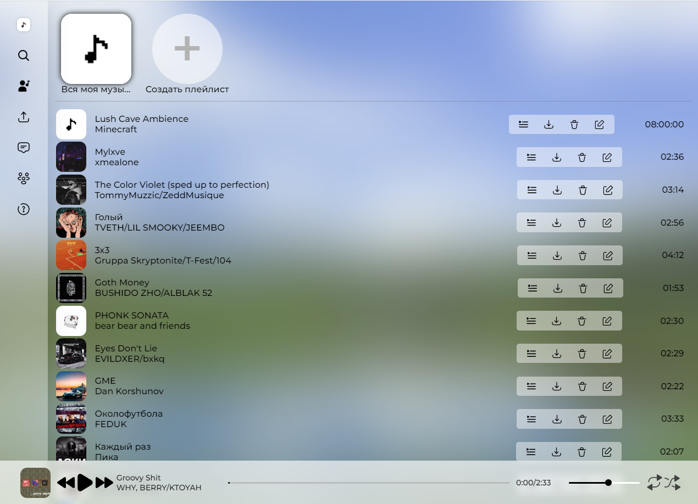
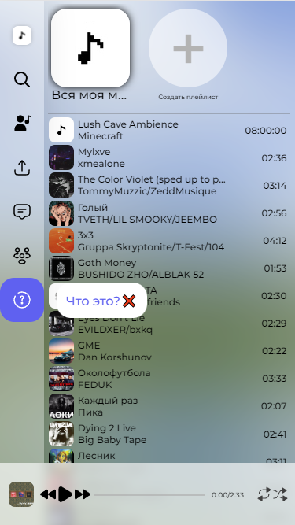

# Bubble Music 🎈

***Bubble 🎈*** - это бесплатный музыкальный сервис, куда вы можете загрузить абсолютно любой трек, 
любой длины. Считаю это концепция того каким должен был быть музыкальный сервис от Яндекс и ВК.
Разработан на основе фреймворка - **FastAPI**

> ⚠ **Примечание:** Находиться на **Alpha** версии,
> имеются баги.
> - Баг с загрузкой треков с iphone

    

        
Вид на ПК 💻:

        
    

    

        
Вид на мобильном телефоне 📱:

        
    

## Будущиее фичи 🎆
- Было бы классно подключить Redis(но пока нет фичь, чтобы подключать Redis).
- Добавить возможность добавления плейлистов и их редактирование
- Добавить возможность добавления друзей (Пока без просмотра их треков и социальных фич)
- Добавить возможность обмена сообщениями с пользователями, в эти сообщения будет входить возможность прикрепления трека, прикрепление плейлиста, ответ на ранее полученное сообщение, выставления реакции на сообщение.
- Добавить типо микро фичу, видеть что друзья в онлайне или нет.
- Думаю добавить систему прокачки, кароче у каждого пользователя будет система уровней, и опыт будет получаться в зависимости сколько пользователь загрузил треков в сервис. Максимальный уроыень будет 100 лвл - загрузил 10000, получаеться 100 треков за уровень. Пользователи за каждый уровень будут открывать новые смайлики который могут оставлять в реакциях, ну или просто слать в личные сообщения. Хммм…
Это может как-то смотивирует их набрать критическую массу для создания нейросети по подбору треков
- САМАЯ ГЛАВНАЯ ФИЧА - Рекомендация треков - Для неё нужна большая база треков

## Что использовано 📝 ? 

- FastAPI
- SQLAlchemy
- PostgreSQL
- Alembic
- Docker
- PyDantic
- Vanil CSS/JS

## Как собрать проект 🛠 ?

Я думаю всё просто:
1) Клонируем репу
2) Билдим контейнер
